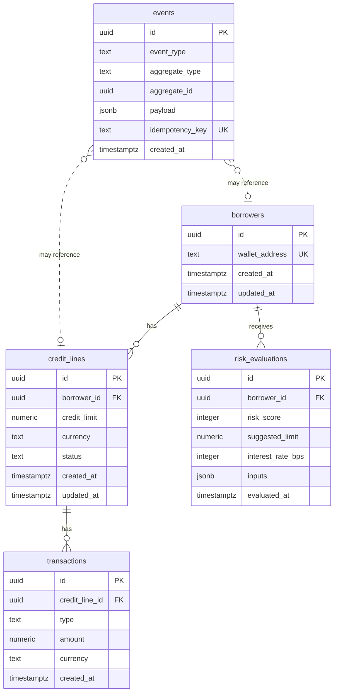

# Creditra Backend — PostgreSQL Data Model

This document describes the relational data model for the Creditra backend: credit lines, borrowers, risk evaluations, transactions, and events. The target database is **PostgreSQL**.

## Overview

The model supports:

- **Borrowers** — Identities (e.g. wallet addresses) that can hold credit lines and receive risk evaluations.
- **Credit lines** — Per-borrower credit facilities with limits, currency, and status.
- **Risk evaluations** — Historical risk scores and suggested limits/rates for borrowers.
- **Transactions** — Draws and repayments against credit lines.
- **Events** — Immutable audit and domain events (e.g. from Horizon) for idempotency and replay.

All primary keys are UUIDs (e.g. `gen_random_uuid()`) unless noted. Timestamps use `timestamptz` for timezone-aware storage.

---

## Entity-Relationship Overview

```
┌─────────────┐       ┌──────────────┐       ┌─────────────────┐
│  borrowers  │───1:N─│ credit_lines │───1:N─│  transactions   │
└─────────────┘       └──────────────┘       └─────────────────┘
       │
       │ 1:N
       ▼
┌──────────────────┐       ┌────────┐
│ risk_evaluations  │       │ events │  (standalone, references aggregates)
└──────────────────┘       └────────┘
```

### Mermaid diagram



---

## Tables

### 1. `borrowers`

Stores borrower identities. The main natural key is `wallet_address` (unique).

| Column           | Type         | Nullable | Description                          |
|------------------|--------------|----------|--------------------------------------|
| `id`             | `uuid`       | NO       | Primary key (default `gen_random_uuid()`) |
| `wallet_address` | `text`       | NO       | Unique wallet/identity address       |
| `created_at`     | `timestamptz`| NO       | Row creation time (default `now()`)  |
| `updated_at`     | `timestamptz`| NO       | Row update time (default `now()`)    |

**Constraints:** `PRIMARY KEY (id)`, `UNIQUE (wallet_address)`.

---

### 2. `credit_lines`

One per borrower (or multiple per borrower if product allows). Tracks limit, currency, and status.

| Column        | Type         | Nullable | Description                          |
|---------------|--------------|----------|--------------------------------------|
| `id`          | `uuid`       | NO       | Primary key                          |
| `borrower_id` | `uuid`       | NO       | FK → `borrowers.id`                  |
| `credit_limit`| `numeric(28,8)` | NO    | Maximum credit (decimal for precision) |
| `currency`    | `text`       | NO       | Currency code (e.g. `USDC`)          |
| `status`      | `text`       | NO       | e.g. `active`, `closed`, `suspended` |
| `created_at`  | `timestamptz`| NO       | Row creation time                    |
| `updated_at`  | `timestamptz`| NO       | Row update time                      |

**Constraints:** `PRIMARY KEY (id)`, `FOREIGN KEY (borrower_id) REFERENCES borrowers(id)`.

---

### 3. `risk_evaluations`

Historical risk evaluations for a borrower (wallet). Stores score, suggested limit, interest rate, and optional inputs snapshot.

| Column             | Type           | Nullable | Description                    |
|--------------------|----------------|----------|--------------------------------|
| `id`               | `uuid`         | NO       | Primary key                    |
| `borrower_id`      | `uuid`         | NO       | FK → `borrowers.id`            |
| `risk_score`       | `integer`      | NO       | Numeric risk score             |
| `suggested_limit`  | `numeric(28,8)`| NO       | Suggested credit limit         |
| `interest_rate_bps`| `integer`      | NO       | Interest rate in basis points  |
| `inputs`           | `jsonb`        | YES      | Snapshot of inputs used        |
| `evaluated_at`     | `timestamptz`  | NO       | When evaluation was performed  |

**Constraints:** `PRIMARY KEY (id)`, `FOREIGN KEY (borrower_id) REFERENCES borrowers(id)`.

---

### 4. `transactions`

Draws and repayments against a credit line.

| Column           | Type           | Nullable | Description                    |
|------------------|----------------|----------|--------------------------------|
| `id`             | `uuid`         | NO       | Primary key                    |
| `credit_line_id` | `uuid`         | NO       | FK → `credit_lines.id`         |
| `type`           | `text`         | NO       | e.g. `draw`, `repayment`       |
| `amount`         | `numeric(28,8)`| NO       | Signed amount (draw +, repay −)|
| `currency`       | `text`         | NO       | Currency code                  |
| `created_at`     | `timestamptz`  | NO       | Transaction time               |

**Constraints:** `PRIMARY KEY (id)`, `FOREIGN KEY (credit_line_id) REFERENCES credit_lines(id)`.

---

### 5. `events`

Immutable domain/audit events (e.g. from Horizon). Supports idempotency via `idempotency_key`.

| Column           | Type         | Nullable | Description                          |
|------------------|--------------|----------|--------------------------------------|
| `id`             | `uuid`       | NO       | Primary key                          |
| `event_type`     | `text`       | NO       | Event name (e.g. `credit_line.created`) |
| `aggregate_type` | `text`       | YES      | e.g. `credit_line`, `borrower`       |
| `aggregate_id`   | `uuid`       | YES      | ID of related entity                 |
| `payload`        | `jsonb`      | YES      | Event body                           |
| `idempotency_key`| `text`       | YES      | Unique key for deduplication         |
| `created_at`     | `timestamptz`| NO       | Event time                           |

**Constraints:** `PRIMARY KEY (id)`, `UNIQUE (idempotency_key)` (partial: only where `idempotency_key IS NOT NULL` — use unique index).

---

## Indexes and Performance

### Recommended indexes

- **borrowers**
  - `borrowers_wallet_address_key` — `UNIQUE (wallet_address)` (created by constraint).
  - Lookup by wallet is the main access path; unique index also enforces integrity.

- **credit_lines**
  - `credit_lines_borrower_id_idx` — `(borrower_id)` for “all lines for a borrower”.
  - `credit_lines_status_idx` — `(status)` for filtering by status.
  - `credit_lines_borrower_status_idx` — `(borrower_id, status)` for “active lines for borrower” if common.

- **risk_evaluations**
  - `risk_evaluations_borrower_id_idx` — `(borrower_id)` for history per borrower.
  - `risk_evaluations_evaluated_at_idx` — `(evaluated_at DESC)` for “latest evaluations” queries.

- **transactions**
  - `transactions_credit_line_id_idx` — `(credit_line_id)` for “all transactions for a line”.
  - `transactions_created_at_idx` — `(credit_line_id, created_at)` for time-ordered history and balance-style queries.

- **events**
  - `events_idempotency_key_key` — `UNIQUE (idempotency_key)` where `idempotency_key IS NOT NULL` (unique partial index).
  - `events_aggregate_idx` — `(aggregate_type, aggregate_id)` for “all events for an aggregate”.
  - `events_created_at_idx` — `(created_at)` for time-ordered replay or cleanup.

### General considerations

- Use **parameterized queries** (prepared statements) everywhere to avoid SQL injection and allow plan caching.
- For high write volume on `events`, consider partitioning by `created_at` (e.g. monthly) later.
- `numeric(28,8)` is used for money-like fields to avoid floating-point issues.

---

## Security

- **Authentication/authorization:** Enforce at the application layer (e.g. JWT, API keys). Do not rely on the DB for user identity.
- **Row-Level Security (RLS):** If multiple tenants share the same DB, add RLS policies so each tenant sees only its rows (e.g. by `tenant_id` or equivalent). For a single-tenant service, RLS is optional but can be added later.
- **Sensitive data:** Avoid storing raw PII in plaintext if possible; document any PII in `payload` or custom columns and consider encryption at rest (e.g. application-level or TDE).
- **Connections:** Use TLS for connections (`sslmode=require` or stronger) and restrict DB user privileges (e.g. no superuser; only needed tables/schemas).
- **Audit:** The `events` table supports an audit trail; ensure event producers write security-relevant actions (e.g. credit line changes, large transactions).

---

## Migration Strategy and Naming Conventions

- **Location:** Migrations live under `migrations/` as sequential SQL files.
- **Naming:** `NNN_short_snake_case_description.sql` (e.g. `001_initial_schema.sql`). No spaces; use underscores.
- **Ordering:** Migrations are applied in filename order. Do not edit or remove already-applied migrations; add new ones to change schema or data.
- **Idempotency:** Prefer `CREATE TABLE IF NOT EXISTS` only for optional/one-off setups; for versioned migrations, use plain `CREATE TABLE` and track applied migrations in a table (e.g. `schema_migrations (version TEXT PRIMARY KEY, applied_at TIMESTAMPTZ)`).
- **Rollback:** Document rollback steps in migration comments or a separate runbook; we do not auto-generate down migrations in this setup.
- **Conventions:**
  - Tables: `snake_case`, plural (e.g. `credit_lines`).
  - Columns: `snake_case`.
  - Primary key: `id` (uuid).
  - Foreign keys: `{table_singular}_id` (e.g. `borrower_id`, `credit_line_id`).
  - Timestamps: `created_at`, `updated_at` where applicable (both `timestamptz`).
  - Indexes: `{table}_{column(s)}_idx` or `{table}_{column(s)}_key` for unique.

---

## Generated SQL

The initial schema DDL is maintained in `migrations/001_initial_schema.sql` and can be applied with:

```bash
psql "$DATABASE_URL" -f migrations/001_initial_schema.sql
```

Or use the project’s validation script (see [Migrations README](./migrations/README.md)) to apply and validate the schema.

---

## References

- [PostgreSQL UUID](https://www.postgresql.org/docs/current/datatype-uuid.html)
- [PostgreSQL JSONB](https://www.postgresql.org/docs/current/datatype-json.html)
- [PostgreSQL Indexes](https://www.postgresql.org/docs/current/indexes.html)
- [Row-Level Security](https://www.postgresql.org/docs/current/ddl-rowsecurity.html)
